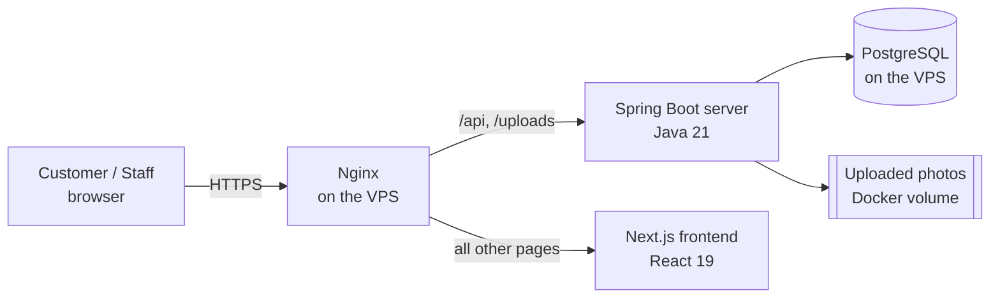
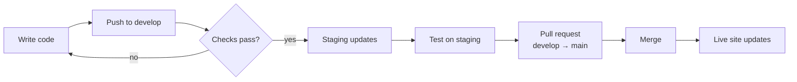
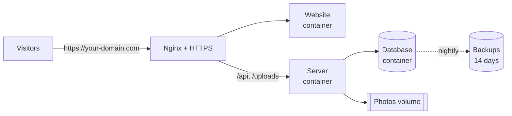
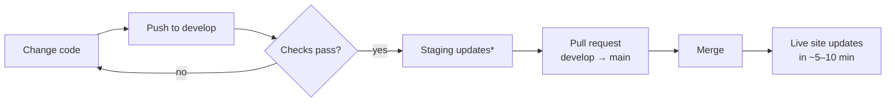

# Raspollob

An online store for natural food products (honey, oils and more), with a full admin panel for running the business: orders, products, stock, promotions, customer messages, staff and permissions.

- **Customers** browse products, choose pack sizes, and order with Cash on Delivery, bKash, Nagad or Rocket.
- **Staff** manage everything from the admin panel. Each person sees only what their role allows.
- **Every push to GitHub is checked automatically**, and approved changes go live on the VPS without manual steps.

---

## Contents

1. [Features](#features)
2. [Architecture](#architecture)
3. [Project structure](#project-structure)
4. [Run it on your computer](#run-it-on-your-computer)
5. [Daily workflow: from code to live site](#daily-workflow-from-code-to-live-site)
6. [How the CI/CD pipeline works](#how-the-cicd-pipeline-works)
7. [One-time deployment setup](#one-time-deployment-setup)
8. [Running the live server](#running-the-live-server)
9. [Troubleshooting](#troubleshooting)
10. [Security checklist](#security-checklist)

---

## Features

**Online store**
- Home page with banners, featured products, categories and customer reviews, all managed from the admin panel
- Product pages with photo galleries and multiple pack sizes (250 g, 500 g, 1 kg…), each with its own price, stock and photos
- One-page cart and checkout with shipping and billing address
- Cash on Delivery, bKash, Nagad and Rocket payments
- Promo codes, customer accounts and a help chat

**Admin panel**
- Sales dashboard (daily, weekly, monthly, yearly) with to-dos and tips
- Orders: status, payment verification, notes, printable delivery labels
- Products, categories, stock, cost and profit
- Promo codes, customer messages, store settings
- Staff accounts, roles and fine-grained permissions

---

## Architecture



| Part | Technology | Folder |
|---|---|---|
| Frontend (store + admin panel) | Next.js 16, React 19, Tailwind CSS 4 | `gui/` |
| Backend API | Spring Boot 4, Java 21, Spring Security (JWT) | `server/` |
| Database | PostgreSQL 16 (Docker, on the VPS) | `deploy/` |
| Hosting | One VPS: Docker + Nginx | `deploy/` |
| CI/CD | GitHub Actions + GitHub Container Registry | `.github/workflows/` |

**How a request flows:** the browser loads pages from Next.js. Pages call the API on the same domain (`/api/v1/...`). Nginx forwards those calls to Spring Boot, which checks the user's permissions and reads or writes the database.

**Permissions:** every role has a permission tree (modules → actions). The server enforces it on every API call; the frontend uses the same tree to show or hide menus and buttons. The built-in `ADMIN` role always has full access.

---

## Project structure

```
Raspollob/
├── gui/                     Next.js frontend
│   ├── app/                 Pages (store, checkout, admin panel…)
│   ├── components/          Shared UI components
│   ├── context/             Login, cart and store settings state
│   ├── lib/  services/      API client, helpers, permissions
│   └── Dockerfile
├── server/                  Spring Boot backend
│   ├── src/main/java/...    Controllers, services, entities, security
│   ├── src/test/java/...    Automated tests
│   └── Dockerfile
├── deploy/                  Files used on the VPS
│   ├── docker-compose.yml   Runs the two containers per environment
│   ├── env.example          Template for the server's settings
│   └── nginx/               Nginx site configuration
└── .github/workflows/
    └── ci-cd.yml            Automatic checks and deployment
```

---

## Run it on your computer

**You need:** Java 21, Node.js 20 or newer, and access to a PostgreSQL database.

### 1. Backend

Create `server/.env` (it's git-ignored, so it never reaches GitHub):

```properties
DB_URL=jdbc:postgresql://HOST:5432/DATABASE?sslmode=require
DB_USERNAME=your_user
DB_PASSWORD=your_password
JWT_SECRET=paste-output-of: openssl rand -base64 48
FRONTEND_URL=http://localhost:3000
```

Then start it:

```bash
cd server
./mvnw spring-boot:run          # Windows: mvnw.cmd spring-boot:run
```

The API runs at `http://localhost:8085`. On first start it creates the tables, the roles and an admin account (**admin / admin123**).

### 2. Frontend

```bash
cd gui
npm install
npm run dev
```

Open `http://localhost:3000`. The admin panel is at `/admin`.

### 3. Run the tests

```bash
cd server && ./mvnw test        # backend tests
cd gui && npx tsc --noEmit      # frontend type-check
```

> Note: the backend's startup test connects to the database in `server/.env`. Point it at a development database, not the live one.

---

## Daily workflow: from code to live site

The repository has two long-lived branches:

| Branch | Purpose | Goes to |
|---|---|---|
| `develop` | Everyday work | **Staging** site (for testing) |
| `main` | What customers see | **Live** site |



**Step by step:**

```bash
# 1. Work on develop
git checkout develop
git pull

# 2. Save and push your changes
git add -A
git commit -m "Describe what you changed"
git push                                  # staging updates in a few minutes

# 3. When staging looks good: open a Pull Request on GitHub
#    develop → main, check it's green, click "Merge"
#    The live site updates automatically.
```

That's all. You never copy files to the server by hand.

---

## How the CI/CD pipeline works

Every push and pull request runs the workflow in `.github/workflows/ci-cd.yml`:

| Stage | What it does | When |
|---|---|---|
| **Backend checks** | Builds the server and runs all tests against a temporary database | Every push and PR |
| **Frontend checks** | Production build and type-check | Every push and PR |
| **Deploy** | Builds Docker images, uploads them to GitHub Container Registry, then updates the VPS | Push to `develop` (staging) or `main` (live), only if checks pass |

During a deploy, GitHub connects to the VPS over SSH and runs `docker compose pull` and `docker compose up -d`. It then **waits until the site answers**. If the new version doesn't start, the run turns red and shows the server logs.

Product photos live in a Docker volume, so they are kept on every deploy.

> Deploying is switched off until the VPS is ready. It turns on when you set the `DEPLOY_ENABLED` variable (step 4 below). Until then, pushes only run the checks.

---

## One-time deployment setup

Do this once, in order. It takes about 30 minutes. Afterwards every update goes live automatically.

**What runs on the VPS:** for each site (live, and optionally staging) there are three Docker containers: the **database** (PostgreSQL), the **server** (Spring Boot) and the **website** (Next.js). Nginx in front gives them your domain and HTTPS.



**VPS size:** Ubuntu 22.04 or 24.04 with **2 GB RAM** (2 vCPU recommended) for the live site only, or **4 GB** if you also run staging. 25 GB+ disk.

### Step 1: Point your domain at the VPS

At your domain provider (DNS settings), add **A records** with your VPS IP address:

| Name | Type | Value |
|---|---|---|
| `@` (your-domain.com) | A | VPS IP |
| `www` | A | VPS IP |
| `staging` | A | VPS IP (only if you use staging) |

DNS can take from a few minutes to a few hours to update. Do this first so it's ready by step 3.

### Step 2: Protect the `main` branch on GitHub

**GitHub → Settings → Branches → Add branch ruleset** for `main`:
- ✅ Require a pull request before merging
- ✅ Require status checks to pass: *Backend · build & test* and *Frontend · type-check & build*

Now only tested code can reach the live site.

### Step 3: Set up the VPS (one command)

From **your computer**, copy the `deploy` folder to the VPS, then log in:

```bash
scp -r deploy root@<vps-ip>:/root/raspollob-deploy
ssh root@<vps-ip>
```

On the VPS, run the setup script with your details:

```bash
cd /root/raspollob-deploy
bash setup-vps.sh --domain your-domain.com --email you@example.com --owner hasankazem22
# add --staging to also create staging.your-domain.com
```

The script:
- installs **Docker**, **Nginx** and a **free HTTPS certificate** (renews automatically)
- turns on the **firewall** (only SSH, HTTP and HTTPS open), **fail2ban** (blocks password guessing) and **automatic security updates**
- adds **swap** memory so the server stays stable on small VPS plans
- creates the **`deploy`** user that GitHub Actions signs in as
- creates `/opt/raspollob/production` with a settings file (`.env`) containing **strong random passwords** for the database and logins
- schedules **nightly backups** at 03:30

It's safe to run again: existing passwords and data are never replaced.

> If HTTPS fails because DNS isn't ready yet, wait a little and run the `certbot` command the script prints.

### Step 4: Create a deploy key

On **your computer**:

```bash
ssh-keygen -t ed25519 -f raspollob-deploy -C "github-actions" -N ""
```

- Copy the **public** key (`raspollob-deploy.pub`) into the VPS:
  ```bash
  ssh root@<vps-ip> "cat >> /home/deploy/.ssh/authorized_keys" < raspollob-deploy.pub
  ```
- The **private** key (`raspollob-deploy`) goes into GitHub in the next step. Delete both files from your computer afterwards.

### Step 5: Add the secrets in GitHub

**GitHub → Settings → Secrets and variables → Actions**

*Secrets* tab → **New repository secret**:

| Name | Value |
|---|---|
| `VPS_HOST` | Your VPS IP address |
| `VPS_USER` | `deploy` |
| `VPS_SSH_KEY` | The full contents of the private key file `raspollob-deploy` |
| `VPS_PORT` | Only if SSH isn't on port 22 |

*Variables* tab → **New repository variable**: `DEPLOY_ENABLED` = `true`

**GitHub → Settings → Environments:** create `production` (and `staging` if used) with a variable `APP_URL`, for example `https://your-domain.com`.

### Step 6: First release

Open **GitHub → Actions → CI/CD → Run workflow** on `main` (or push to `main`). After about 5–10 minutes it turns green and the site is live.

On first start the server **creates all database tables** and the roles, plus one admin account:

1. Open `https://your-domain.com/admin` and sign in as **admin / admin123**.
2. **Change this password immediately** (Profile → Password).
3. Add your logo, colours, categories, products and payment numbers in the admin panel.

---

## Updating the live site (day to day)

Everything below happens from your computer and GitHub. You don't need to log in to the VPS.


<sub>*only if you set up staging</sub>

```bash
git checkout develop
git pull
# ...make your changes...
git add -A
git commit -m "Describe the change"
git push
```

Then on GitHub: **Pull requests → New → `develop` → `main` → Create → Merge** once the checks are green. That's the whole release.

- **Database changes are automatic.** New columns or tables are added when the new server starts. Existing data is never deleted.
- **No downtime to plan.** The new version starts and the pipeline only reports success once the site answers. If it doesn't start, the run turns red and shows the error.
- **Shop content** (products, prices, banners, offers, colours) is changed in the admin panel, not in code. That needs no deploy at all.

---

## Running the live server

All commands run on the VPS (`ssh root@<vps-ip>`).

```bash
cd /opt/raspollob/production          # or /opt/raspollob/staging

docker compose ps                     # is everything running?
docker compose logs -f server         # live backend logs (Ctrl+C to stop)
docker compose logs -f gui            # live frontend logs
docker compose restart server         # restart the backend
```

**Backups** (database + photos, every night at 03:30, last 14 days kept):

```bash
ls /opt/raspollob/backups/production                       # list backups
/opt/raspollob/backup.sh production                        # make one now (e.g. before a big change)
/opt/raspollob/restore.sh production 2026-10-07_0330       # restore one (asks for confirmation)
tail /var/log/raspollob-backup.log                         # did last night's backup work?
```

> **Keep a copy off the server.** Backups on the VPS don't help if the VPS itself is lost. Once a week, download the newest backup folder to your computer or cloud storage:
> `scp -r root@<vps-ip>:/opt/raspollob/backups/production/<latest> ./raspollob-backups/`

**Roll back to an earlier version.** Every release is tagged with its full commit id (on GitHub: *Commits* → copy the full SHA):

```bash
cd /opt/raspollob/production
IMAGE_TAG=<commit-id> docker compose up -d
```

The next normal deploy moves you forward again.

**Change a setting:** edit `.env` in the site's folder, then `docker compose up -d`. Don't change `POSTGRES_PASSWORD` after the first start: the database keeps its original password.

---

## Troubleshooting

| Problem | What to check |
|---|---|
| Pipeline red at **Backend checks** | Open the run on GitHub → the failing test is listed. Fix it on `develop` and push again. |
| Pipeline red at **Deploy** | The log ends with the server's own logs. Usually a wrong value in the VPS `.env`. |
| Deploy skipped | `DEPLOY_ENABLED` isn't set to `true` (step 5). |
| `permission denied (publickey)` | The public key isn't in `/home/deploy/.ssh/authorized_keys`, or `VPS_SSH_KEY` is incomplete. |
| Site shows *502 Bad Gateway* | Containers aren't running: `docker compose ps` and `docker compose logs server`. |
| Server can't reach the database | `docker compose ps db` should say *healthy*; check `docker compose logs db`. |
| HTTPS certificate error | DNS must point at the VPS first; then run the `certbot` command again. |
| Disk getting full | `df -h` and `docker system df`; old images are removed on each deploy, backups after 14 days. |
| Photos won't upload | Nginx `client_max_body_size` must be `30M` (set by the setup script). |

---

## Security checklist

- [ ] No passwords in the repository: they live in `.env` files on the VPS, which are git-ignored
- [ ] Change the default admin password (`admin123`) right after the first release
- [ ] The database has no public port; only the server container can reach it
- [ ] Firewall on (SSH, HTTP, HTTPS only), fail2ban and automatic security updates enabled (setup script)
- [ ] Keep `main` protected so only checked code reaches the live site
- [ ] Copy a backup off the server every week
