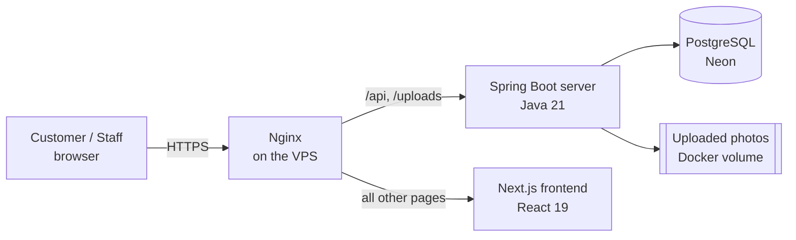
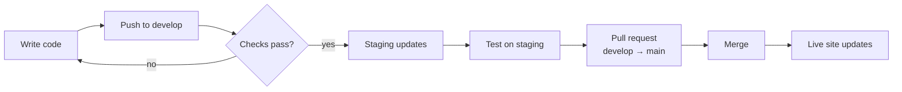

# Raspollob

An online store for natural food products (honey, oils and more), with a full admin panel for running the business: orders, products, stock, promotions, customer messages, staff and permissions.

- **Customers** browse products, choose pack sizes, and order with Cash on Delivery, bKash, Nagad or Rocket.
- **Staff** manage everything from the admin panel. Each person sees only what their role allows.
- **Every push to GitHub is checked automatically**, and approved changes go live on the VPS without manual steps.

---

## Contents

1. [Features](#features)
2. [Architecture](#architecture)
3. [Project structure](#project-structure)
4. [Run it on your computer](#run-it-on-your-computer)
5. [Daily workflow: from code to live site](#daily-workflow-from-code-to-live-site)
6. [How the CI/CD pipeline works](#how-the-cicd-pipeline-works)
7. [One-time deployment setup](#one-time-deployment-setup)
8. [Running the live server](#running-the-live-server)
9. [Troubleshooting](#troubleshooting)
10. [Security checklist](#security-checklist)

---

## Features

**Online store**
- Home page with banners, featured products, categories and customer reviews, all managed from the admin panel
- Product pages with photo galleries and multiple pack sizes (250 g, 500 g, 1 kg…), each with its own price, stock and photos
- One-page cart and checkout with shipping and billing address
- Cash on Delivery, bKash, Nagad and Rocket payments
- Promo codes, customer accounts and a help chat

**Admin panel**
- Sales dashboard (daily, weekly, monthly, yearly) with to-dos and tips
- Orders: status, payment verification, notes, printable delivery labels
- Products, categories, stock, cost and profit
- Promo codes, customer messages, store settings
- Staff accounts, roles and fine-grained permissions

---

## Architecture



| Part | Technology | Folder |
|---|---|---|
| Frontend (store + admin panel) | Next.js 16, React 19, Tailwind CSS 4 | `gui/` |
| Backend API | Spring Boot 4, Java 21, Spring Security (JWT) | `server/` |
| Database | PostgreSQL (Neon) | — |
| Hosting | One VPS: Docker + Nginx | `deploy/` |
| CI/CD | GitHub Actions + GitHub Container Registry | `.github/workflows/` |

**How a request flows:** the browser loads pages from Next.js. Pages call the API on the same domain (`/api/v1/...`). Nginx forwards those calls to Spring Boot, which checks the user's permissions and reads or writes the database.

**Permissions:** every role has a permission tree (modules → actions). The server enforces it on every API call; the frontend uses the same tree to show or hide menus and buttons. The built-in `ADMIN` role always has full access.

---

## Project structure

```
Raspollob/
├── gui/                     Next.js frontend
│   ├── app/                 Pages (store, checkout, admin panel…)
│   ├── components/          Shared UI components
│   ├── context/             Login, cart and store settings state
│   ├── lib/  services/      API client, helpers, permissions
│   └── Dockerfile
├── server/                  Spring Boot backend
│   ├── src/main/java/...    Controllers, services, entities, security
│   ├── src/test/java/...    Automated tests
│   └── Dockerfile
├── deploy/                  Files used on the VPS
│   ├── docker-compose.yml   Runs the two containers per environment
│   ├── env.example          Template for the server's settings
│   └── nginx/               Nginx site configuration
└── .github/workflows/
    └── ci-cd.yml            Automatic checks and deployment
```

---

## Run it on your computer

**You need:** Java 21, Node.js 20 or newer, and access to a PostgreSQL database.

### 1. Backend

Create `server/.env` (it's git-ignored, so it never reaches GitHub):

```properties
DB_URL=jdbc:postgresql://HOST:5432/DATABASE?sslmode=require
DB_USERNAME=your_user
DB_PASSWORD=your_password
JWT_SECRET=paste-output-of: openssl rand -base64 48
FRONTEND_URL=http://localhost:3000
```

Then start it:

```bash
cd server
./mvnw spring-boot:run          # Windows: mvnw.cmd spring-boot:run
```

The API runs at `http://localhost:8085`. On first start it creates the tables, the roles and an admin account (**admin / admin123**).

### 2. Frontend

```bash
cd gui
npm install
npm run dev
```

Open `http://localhost:3000`. The admin panel is at `/admin`.

### 3. Run the tests

```bash
cd server && ./mvnw test        # backend tests
cd gui && npx tsc --noEmit      # frontend type-check
```

> Note: the backend's startup test connects to the database in `server/.env`. Point it at a development database, not the live one.

---

## Daily workflow: from code to live site

The repository has two long-lived branches:

| Branch | Purpose | Goes to |
|---|---|---|
| `develop` | Everyday work | **Staging** site (for testing) |
| `main` | What customers see | **Live** site |



**Step by step:**

```bash
# 1. Work on develop
git checkout develop
git pull

# 2. Save and push your changes
git add -A
git commit -m "Describe what you changed"
git push                                  # staging updates in a few minutes

# 3. When staging looks good: open a Pull Request on GitHub
#    develop → main, check it's green, click "Merge"
#    The live site updates automatically.
```

That's all. You never copy files to the server by hand.

---

## How the CI/CD pipeline works

Every push and pull request runs the workflow in `.github/workflows/ci-cd.yml`:

| Stage | What it does | When |
|---|---|---|
| **Backend checks** | Builds the server and runs all tests against a temporary database | Every push and PR |
| **Frontend checks** | Production build and type-check | Every push and PR |
| **Deploy** | Builds Docker images, uploads them to GitHub Container Registry, then updates the VPS | Push to `develop` (staging) or `main` (live), only if checks pass |

During a deploy, GitHub connects to the VPS over SSH and runs `docker compose pull` and `docker compose up -d`. It then **waits until the site answers**. If the new version doesn't start, the run turns red and shows the server logs.

Product photos live in a Docker volume, so they are kept on every deploy.

> Deploying is switched off until the VPS is ready. It turns on when you set the `DEPLOY_ENABLED` variable (step 4 below). Until then, pushes only run the checks.

---

## One-time deployment setup

Do these steps once. Afterwards everything is automatic.

### Step 1: Push the code to GitHub

```bash
git remote add origin https://github.com/HasanKazem22/Raspollob.git
git push -u origin main
git push -u origin develop
```

Then protect `main` so only checked code can reach the live site.
**GitHub → Settings → Branches → Add branch ruleset** for `main`:
- ✅ Require a pull request before merging
- ✅ Require status checks to pass: *Backend · build & test* and *Frontend · type-check & build*

### Step 2: Prepare the VPS (Ubuntu 22.04 / 24.04)

Log in to the VPS and run:

```bash
# Docker
curl -fsSL https://get.docker.com | sudo sh

# A user that GitHub uses to deploy
sudo adduser --disabled-password --gecos "" deploy
sudo usermod -aG docker deploy

# Folders for the live and staging sites
sudo mkdir -p /opt/raspollob/production /opt/raspollob/staging
sudo chown -R deploy:deploy /opt/raspollob

# Web server and free HTTPS certificates
sudo apt update && sudo apt install -y nginx certbot python3-certbot-nginx
```

### Step 3: Create a deploy key

On **your computer**:

```bash
ssh-keygen -t ed25519 -f raspollob-deploy -C "github-actions" -N ""
```

This creates two files:
- `raspollob-deploy.pub` (public key): add it on the VPS:
  ```bash
  sudo mkdir -p /home/deploy/.ssh
  sudo nano /home/deploy/.ssh/authorized_keys      # paste the .pub contents
  sudo chown -R deploy:deploy /home/deploy/.ssh && sudo chmod 700 /home/deploy/.ssh && sudo chmod 600 /home/deploy/.ssh/authorized_keys
  ```
- `raspollob-deploy` (private key): goes into GitHub in the next step. Delete both files from your computer afterwards.

### Step 4: Add the secrets in GitHub

**GitHub → Settings → Secrets and variables → Actions**

*Secrets* tab → **New repository secret**:

| Name | Value |
|---|---|
| `VPS_HOST` | Your VPS IP address |
| `VPS_USER` | `deploy` |
| `VPS_SSH_KEY` | The full contents of the private key file `raspollob-deploy` |
| `VPS_PORT` | Only if SSH isn't on port 22 |

*Variables* tab → **New repository variable**:

| Name | Value |
|---|---|
| `DEPLOY_ENABLED` | `true` (switches on automatic deploys; set it after steps 5–6) |

**GitHub → Settings → Environments:** create `production` and `staging`. In each, add a variable `APP_URL` with the site address. Optional: under `production`, add yourself as a *required reviewer* to approve each live release with one click.

### Step 5: Server settings on the VPS

Create one settings file per site from the template in `deploy/env.example`:

```bash
nano /opt/raspollob/production/.env
nano /opt/raspollob/staging/.env
chmod 600 /opt/raspollob/*/.env
```

| Setting | Production | Staging |
|---|---|---|
| `APP_ENV` | `production` | `staging` |
| `IMAGE_OWNER` | `hasankazem22` | `hasankazem22` |
| `IMAGE_TAG` | `main` | `develop` |
| `GUI_PORT` / `SERVER_PORT` | `3000` / `8085` | `3001` / `8086` |
| `DB_URL`, `DB_USERNAME`, `DB_PASSWORD` | Live database | **A separate database** (in Neon: create a branch called `staging`) |
| `JWT_SECRET` | New value: `openssl rand -base64 48` | A different new value |
| `FRONTEND_URL` | `https://your-domain.com` | `https://staging.your-domain.com` |

### Step 6: Domain, Nginx and HTTPS

1. At your domain provider, point `your-domain.com`, `www` and `staging` to the VPS IP address (A records).
2. In `deploy/nginx/raspollob.conf`, replace `raspollob.com` with your domain. Then copy both Nginx files from **your computer** to the VPS:

```bash
scp deploy/nginx/raspollob.conf deploy/nginx/raspollob-proxy.conf <your-user>@<vps-ip>:/tmp/
```

3. On the VPS:

```bash
cd /tmp
sudo cp raspollob-proxy.conf /etc/nginx/snippets/
sudo cp raspollob.conf /etc/nginx/sites-available/
sudo ln -s /etc/nginx/sites-available/raspollob.conf /etc/nginx/sites-enabled/
sudo nginx -t && sudo systemctl reload nginx

# Free HTTPS (renews automatically)
sudo certbot --nginx -d your-domain.com -d www.your-domain.com -d staging.your-domain.com
```

### Step 7: First release

Set `DEPLOY_ENABLED` to `true` (step 4), then push to `develop`, or open **GitHub → Actions → CI/CD → Run workflow**. Watch it go green, then open your staging site. Merge `develop` into `main` to publish the live site.

---

## Running the live server

All commands run on the VPS.

```bash
cd /opt/raspollob/production          # or /opt/raspollob/staging

docker compose ps                     # is everything running?
docker compose logs -f server         # live backend logs (Ctrl+C to stop)
docker compose logs -f gui            # live frontend logs
docker compose restart server         # restart the backend
```

**Roll back to an earlier version.** Every release is tagged with its commit id (find it on GitHub under *Commits*):

```bash
cd /opt/raspollob/production
IMAGE_TAG=<commit-id> docker compose up -d
```

The next normal deploy moves you forward again.

**Change a setting** (e.g. a password): edit `.env` in the site's folder, then `docker compose up -d`.

---

## Troubleshooting

| Problem | What to check |
|---|---|
| Pipeline red at **Backend checks** | Open the run on GitHub → the failing test is listed. Fix it on `develop` and push again. |
| Pipeline red at **Deploy** | The log ends with the server's own logs. Usually a wrong value in the VPS `.env` (database or `JWT_SECRET`). |
| Deploy skipped | `DEPLOY_ENABLED` isn't set to `true` (step 4). |
| `permission denied (publickey)` | The public key isn't in `/home/deploy/.ssh/authorized_keys`, or `VPS_SSH_KEY` is incomplete. |
| Site shows *502 Bad Gateway* | Containers aren't running: `docker compose ps` and `docker compose logs server`. |
| Photos won't upload | Nginx `client_max_body_size` must be `30M` (already in `raspollob.conf`). |

---

## Security checklist

- [ ] No passwords in the repository: they live in `.env` files, which are git-ignored
- [ ] Change the default admin password (`admin123`) before going live
- [ ] Use different `JWT_SECRET` values and databases for staging and production
- [ ] Keep `main` protected so only checked code reaches the live site
- [ ] Keep the VPS updated: `sudo apt update && sudo apt upgrade`
